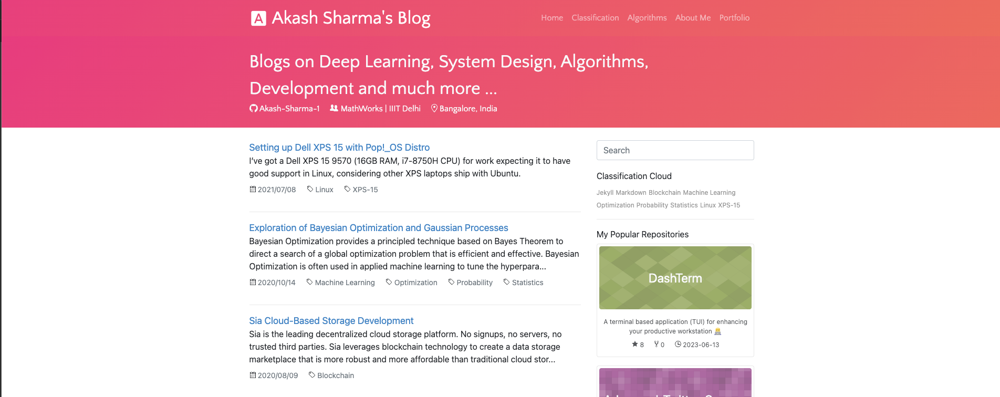

# Akash Sharma's Blog

This is a blog where I share my personal learnings from various domains and fields in terms of articles explaining the motivation, learning and working along with other aspects for others to read and enjoy while learning at the same time. 

This blog is built on a customised light and responsive Jekyll theme. I deployed this Jekyll theme onto theGGithub Pages' remote theme which is kind of like a [gem-based theme](https://jekyllrb.com/docs/themes/#understanding-gem-based-themes). It forms a really good pipeline structure for writing the blog articles in the form of a markdown article and which gets generated on compiling and building the project.

## Usage
U can simply visit https://blog.akashomatics.space/ for viewing the blog and its content.
I'll also try to make a revised Jekyll template in a separate repo available for cloning and getting started with a differnt blog for others to use it.
